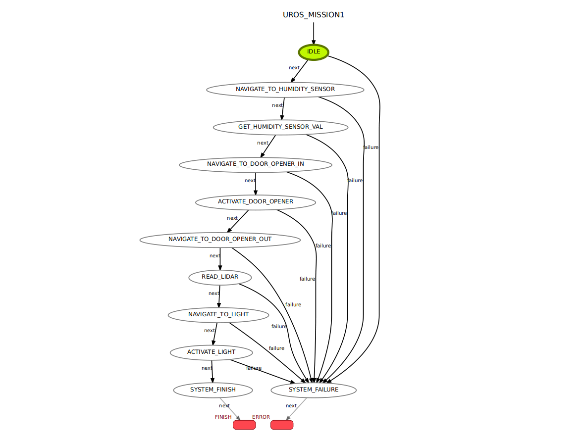
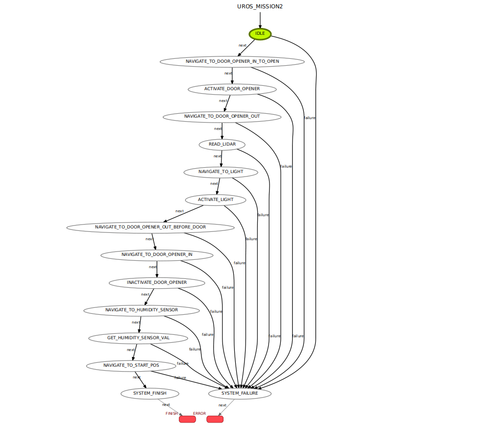
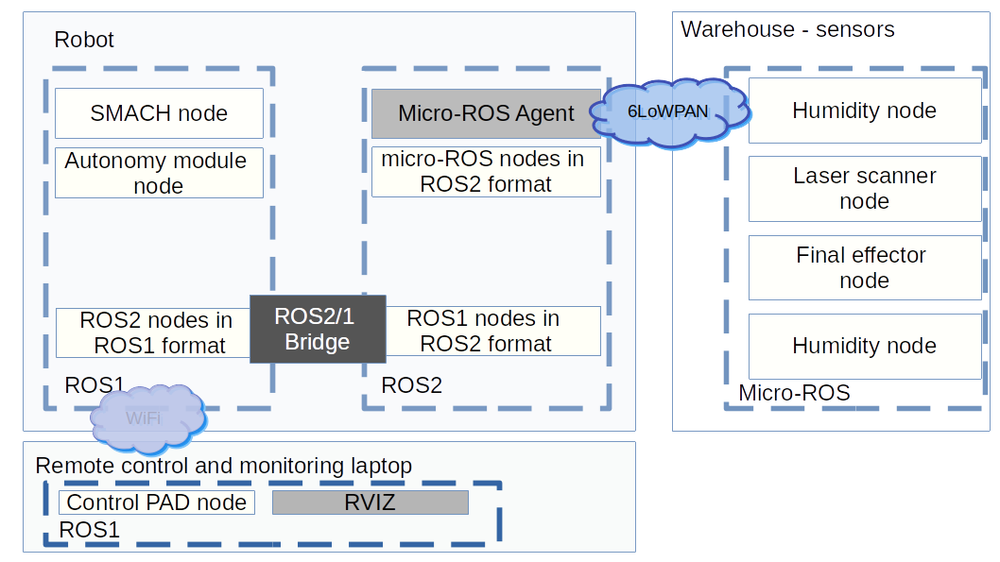

# micro-ROS_warehouse_demo

The series of micro-ROS real-life demos have proven yet the maturity and efficiency of the micro-ROS framework. The warehouse demo is no exception to it.

This page describes the general set up at first.
Then the focus will be moved toward the sensor configuration and additional
work. finally a demonstration will showed.

## Mission description

In this demonstration, a robot will be accomplishing different tasks.
Those tasks consists in harvesting data and activate different elements located at different position within a given warehouse . The goal is to demonstrate that the micro-ROS is able to integrate and perform great into every eco-system (hardware and software).

Two tasks are described below in a form of two different state machines. There were generated by the smach-viewer tool [https://github.com/amx-piap/executive_smach_visualization](https://github.com/amx-piap/executive_smach_visualization)

Mission 1:


Mission 2:



## Set-up

In this set-up the different actors playing are:

 * A robot platform with an Intel NUC (x86 computer) platform
 * A laptop that will monitor the robot
 * Different sensors that are:

   * A temperature and humidity sensor
   * A Door actuator and its status
   * A distance measurement provider,
   * A final effector which is a light to switch on.

The robot communication interfaces are 

 * A Wireless network communication between a laptop and the robot.
 * A Low power wireless hardware, the 6LoWPAN atusb will be used.

It goes without saying that there are more communication mediums, such as, the indoor positioning, CAN bus and ethernet bus. But these elements are complex and dealing with them goes beyond the scope of this document.
### Tool and environnement map map

The robot platform under use, is heavily tied for the ROS1 part for the following
elements:

 * SMACH: State machine ROS task executor
 * Autonomy module and other related module: Using some private package as well as the ROS 
 * Different ROS module needed for positioning and obstacle detection.

Even though it is possible, porting the above-mentioned modules would be too much overhead. So instead, ROS1/2 bridge was added so that all messages from ROS1 are forwarded to ROS2 and vice-versa.

Below a picture picturing the software map:



### Setting up the robot platform

1. The robot platform will be running using ROS1 **noetic**. The following link should be read: 

    * ROS 1 installation [http://wiki.ros.org/ROS/Installation](http://wiki.ros.org/ROS/Installation)
    * ROS 1 usage [http://wiki.ros.org/ROS/Tutorials](http://wiki.ros.org/ROS/Tutorials)
 
2. Install the ROS 1 package [uros_controller](uros_controller) as following. **Beware that the waypoints are set according to the PIAP's warehouse. Modifications should be done to one's usage**.

3. Additionally to ROS1, ROS2 **foxy** shall be installed and run as explained below:

    * Installation of ROS 2[https://index.ros.org/doc/ros2/Installation/#installationguide](https://index.ros.org/doc/ros2/Installation/#installationguide)
    * ROS 2 usage [https://index.ros.org/doc/ros2/Tutorials/](https://index.ros.org/doc/ros2/Tutorials/) 


### Setting up monitoring laptop (Optional)

The different element for monitoring the robot platform:

 * On the laptop,  only ROS1 has to be installed as in the first point of the [robot platform setup](#setting-up-the-robot-platform),
 * The RVIZ package can be used as a monitoring software, more info: [http://wiki.ros.org/rviz](http://wiki.ros.org/rviz)

### Setting up the sensors

#### Environment set up using docker

Download the micro-ROS base Foxy image from the [Docker Hub](https://hub.docker.com/), then run a docker container.

```bash
sudo docker pull microros/base:foxy
sudo docker run -it --net=host --privileged -v /dev/bus/usb:/dev/bus/usb microros/base:foxy
```

#### Create a ROS 2 workspace in the uros_ws folder of the docker container and build the package.

```bash
source /opt/ros/$ROS_DISTRO/setup.bash
git clone -b $ROS_DISTRO https://github.com/micro-ROS/micro_ros_setup.git src/micro_ros_setup
apt update && rosdep update
rosdep install --from-path src --ignore-src -y
apt-get install python3-pip
apt-get -y install python3-pip
colcon build
source install/local_setup.bash
```

#### Create the Nuttx firmware on Olimex-E407 with user case sensor applications.

```bash
ros2 run micro_ros_setup create_firmware_ws.sh nuttx olimex-stm32-e407
cd firmware/NuttX
git checkout -t origin/ucs_demo_f
cd ../apps
git checkout -t origin/ucs_demo_f
cd ..
```

#### Configure NUTTX tools to be able using the menuconfig application.

```bash
git clone https://bitbucket.org/nuttx/tools.git firmware/tools
cd firmware/tools/kconfig-frontends
./configure
autoreconf -f -i 
make
make install
ldconfig
cd -
```

#### Install additional applications

```bash
apt update
apt install -y genromfs vim
```

#### Complete configuration with micro-ros DEMO BOX messages and the convenient config file for flashing firmware,

```bash
git clone http://10.0.9.18/abratek/uros-ucs.git ./tmp
cp -r ./tmp/uros_demo/ ./firmware/mcu_ws/uros_demo
cp ./tmp/config_f/flash_dashing.sh ./install/micro_ros_setup/config/nuttx/generic/flash.sh 
rm -rf tmp/
```

#### Building the laser distance application

Set the config profile variable to select the TFMini distance application.

```bash
CFG_PROFILE=ucs_distance_romfs
```

Follow up the building and flashing procedure

#### Building the humidity sensor application

Set the config profile variable to select the Hih6130 humidity application.

```bash
CFG_PROFILE=ucs_hih6130_romfs
```

Follow up the building and flashing procedure

#### Building the door opener application

Set the config profile variable to select the door opener application.

```bash
CFG_PROFILE=ucs_opener_romfs
```

Follow up the building and flashing procedure

#### Building the Final Effector

Set the config profile variable to select the final effector application.

```bash
CFG_PROFILE=ucs_effector_romfs
```

Follow up the building and flashing procedure

#### Building and flashing an application firmware

Run the following commands in the micro-ROS workspace folder to get the config profile, prepare a startup script, then build and flash an application to the Olimex-E407 board.

```bash
cd /uros_ws/
ros2 run micro_ros_setup configure_firmware.sh $CFG_PROFILE
cp firmware/NuttX/configs/olimex-stm32-e407/$CFG_PROFILE/rcS.template firmware/apps/nshlib/rcS.template
cd firmware/apps/nshlib/
../../NuttX/tools/mkromfsimg.sh -nofat ../../NuttX/
cd /uros_ws/
ros2 run micro_ros_setup build_firmware.sh
ros2 run micro_ros_setup flash_firmware.sh
```

## Run the sensors

Powering the sensors is enough for them to start their application.

## Run the application on the robot platform

Finally, once everything is set-up, the coommand below should be executed:

1. The ROS1/ROS2/ ROS bridge shall be launched

```bash
. <ros-install-dir>/setup.bash
. <ros2-install-dir>/setup.bash
export ROS_MASTER_URI=http://localhost:11311
ros2 run ros1_bridge dynamic_bridge --bridge-all-2to1-topics 
```

2. Script to set-up the 6LoWPAN [wpan_atusb.sh](./scripts/wpan_atusb.sh)

3. Run the docker:
  
    * Installation of docker [https://docs.docker.com/get-docker/](https://docs.docker.com/get-docker/)
    * The agent execution: ``` docker run -it --net=host --rm microros/micro-ros-agent:foxy udp4 --port 9999 ```


4. Execute the SMACH state machine using the the ROS1 environment: 

    * ```rosrun uros_controller smach_node_mission1.py``` for mission 1,
    * ```rosrun uros_controller smach_node_mission2.py``` for mission 2.

## Run the monitoring application on the laptop

The application to execute the run should in on terminal,

```bash
. <ros-install-dir>/setup.bash
export ROS_MASTER_URI=http://IP_ADDR_ROBOT_PLATFORM:11311
rviz

```

and in another terminal:

```
. <ros-install-dir>/setup.bash
export ROS_MASTER_URI=http://IP_ADDR_ROBOT_PLATFORM:11311
rosrun smach_viewer smach_viewer.py
```

## License

This repository is open-sourced under the Apache-2.0 license. See the LICENSE file for details.

For a list of other open-source components included in this repository, see the
file [3rd-party-licenses.txt](./3rd-party-licenses.md)

## Known Issues/Limitations

There are no known limitations.
